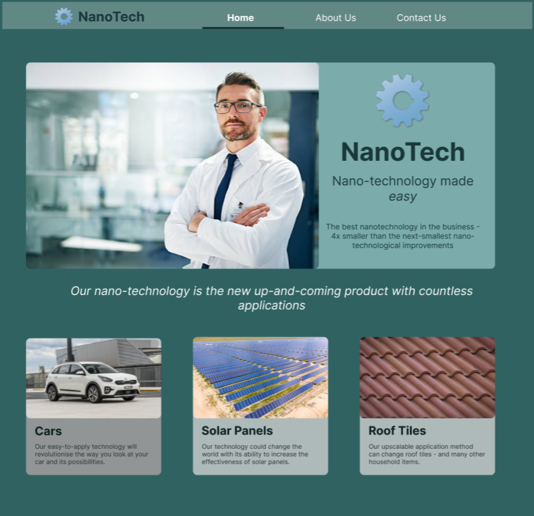

# Nanotechnology Site (React)

A simple nanotechnology mockup site with a Home, About Us and a Contact Us page. Made using React, SCSS and HTML with use of react-router-dom.

## Styling

The colour palette is largely a range of blues with some grey and white highlights. This gives a futuristic feel and while it is middle-of-the-road for nanotechnology websites, it is also a safe choice especially for a startup.

I created a quick mock-up of this site before starting with Figma:

This mockup needs to be developed further before development starts, especially regarding the About Us and Contact pages.
