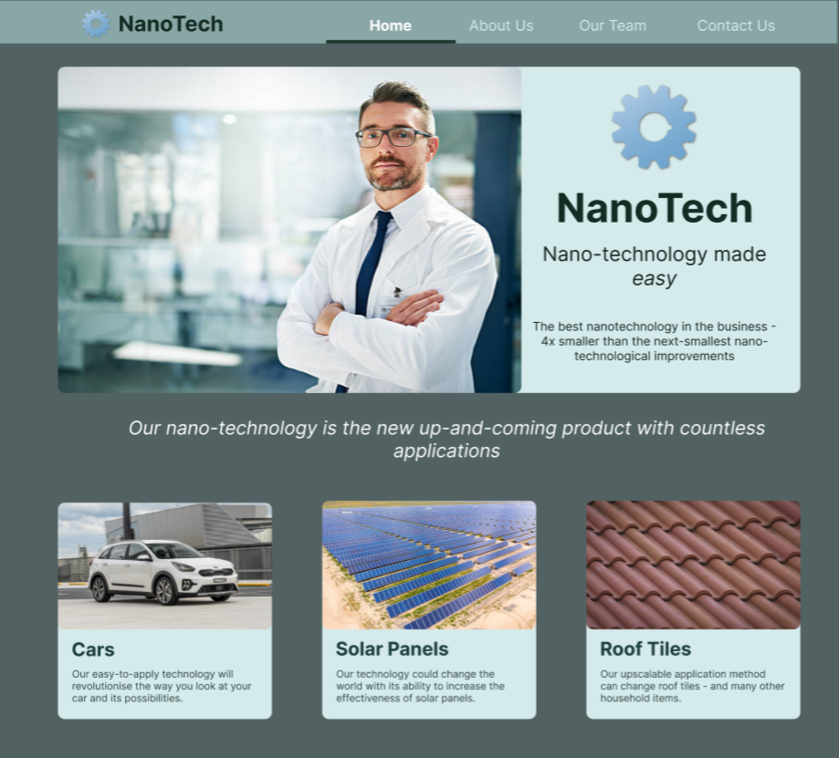

# Nanotechnology Site (React)

A simple nanotechnology mockup site with a Home, About Us and a Contact Us page. Made using React, SCSS and HTML with use of react-router-dom.

## Personal Goals:

-   Gain more experience with React-Router-DOM
-   Gain experience in creating mockup websites using software such as Figma

## Styling

The colour palette is largely a range of green-blues with some grey and white highlights. This gives a futuristic feel and while it is middle-of-the-road for nanotechnology websites, it is also a safe choice especially for a startup.

I created a quick mock-up of this site before starting with Figma. The screenshots of these can be found in the mockup-final folder. Here is the homepage mockup.

To assist with my development, I will annotate these with how I will develop each element and the structure before beginning the development process.
